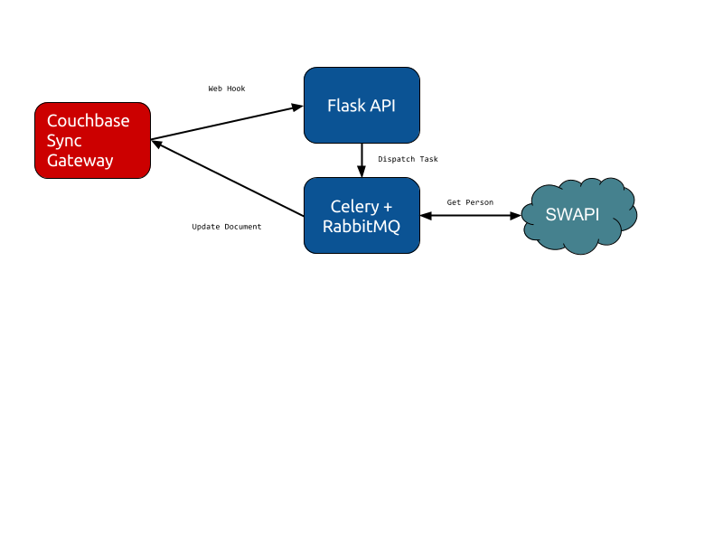

# Offline First Apps with Couchbase Sync Gateway

This code was made for an article I wrote about how to develop offline first
applications using [Couchbase Sync Gateway](https://developer.couchbase.com/documentation/mobile/1.3/installation/sync-gateway/index.html).


## Concept

While studying react-redux, something that I really liked is the [Async Actions](http://redux.js.org/docs/advanced/AsyncActions.html)
pattern where you have:

```js
{ type: 'FECH_POSTS_REQUEST' }
{ type: 'FECH_POSTS_FAILURE', error: 'Oops' }
{ type: 'FECH_POSTS_SUCCESS', response: { ... } }
```

This pattern provides a very good user experience because you actually render
the page based on the current status of the app. I'm trying to achieve the
same results but for offline first applications using Couchbase.

## Proof of Concept

To create a PoF, I develop this project and everytime you save a document with:
```js
{
  "action": "person_request"
}
```

It Couchbase Sync Gateway call Flask which will schedule a Task that will
retrieve a random person(20% chances of failing) from SWAPI.

- Couchbase Sync Gateway
- Flask API
- Celery + Redis



## Running

```
docker-compose up
```

## Testing

First clone this [repo](https://github.com/rafaelugolini/pouchdb_console) to
see all the changes being made in real time and then just add a document with
curl.

```sh
curl -H "Content-Type: application/json" -X POST -d '{"action":"person_request"}' http://localhost:4984/db/
```
